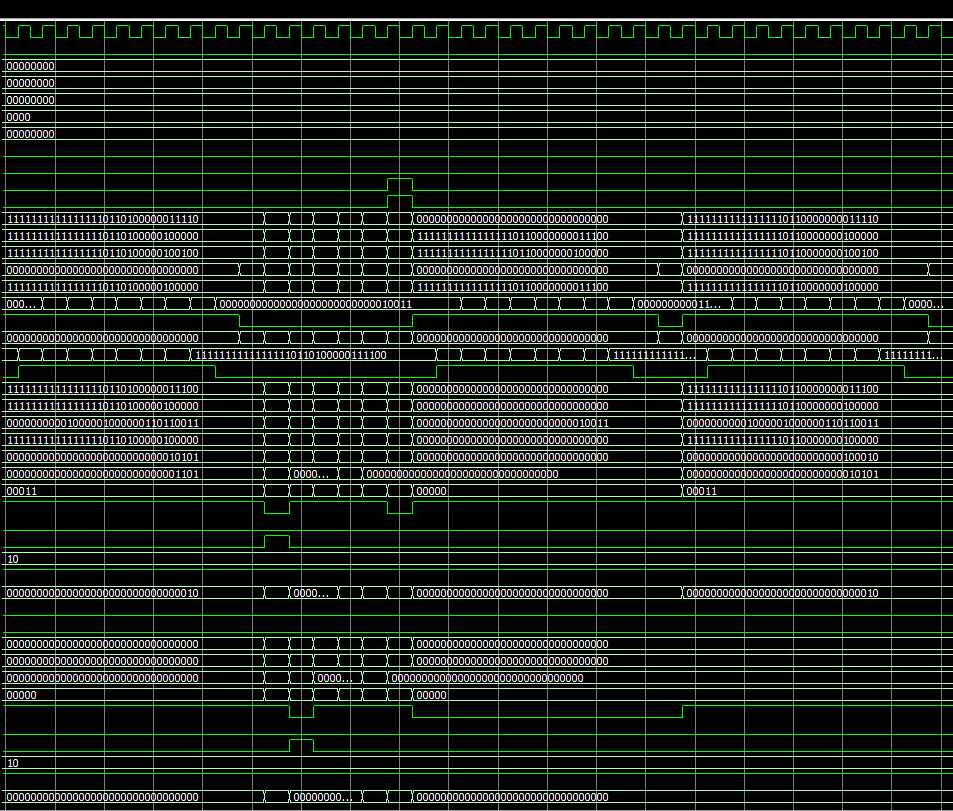
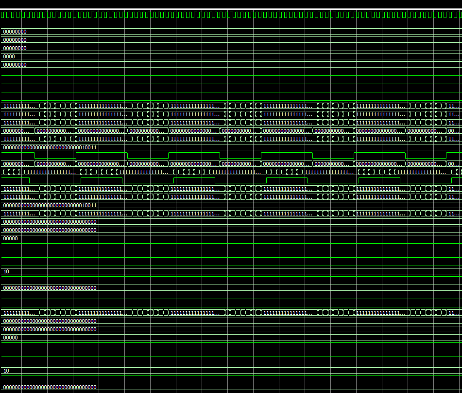

# MRKK-32

A 32-bit pipelined RISC-V processor, designed and verified from scratch in VHDL.

MRKK-32 implements the RV32I base integer ISA plus the RV32M multiply/divide extension. Every module — ALU, register file, hazard detection, caches, interrupt controller, memory-mapped peripherals — was written by hand and verified with self-checking testbenches. No generated cores, no textbook skeletons.

```
ISA              RV32I + RV32M (55 instructions)
Pipeline         3-stage: Fetch / Decode+Execute / Writeback
Architecture     Harvard (separate instruction and data memory)
Caches           L1 I-cache + D-cache, direct-mapped, 1KB each
Peripherals      UART, GPIO, 32-bit Timer
Interrupts       4-line fixed-priority controller
HDL              VHDL-2008
RTL              18 files, 2,522 lines
Testbenches      11 files, 145+ verified test cases, zero failures
```

## Why this exists

Most student CPU projects stop at "it adds two numbers in a simulator." MRKK-32 goes further: it has a real memory hierarchy with caching and hazard handling, it services interrupts with correct PC/cause save-restore, it talks to memory-mapped peripherals, and every architectural choice is documented with the reasoning behind it — not just the result.

## Proof it works

The full system testbench (`tb_mrkk32.vhd`) runs a hand-assembled RISC-V program that computes the first 10 Fibonacci numbers and stores each result to data memory:

```asm
addi x1, x0, 0      # a = fib(n-2)
addi x2, x0, 1      # b = fib(n-1)
addi x4, x0, 8       # loop counter
addi x5, x0, 8       # store pointer
sw   x1, 0(x0)       # mem[0] = fib(0)
sw   x2, 4(x0)       # mem[4] = fib(1)
loop:
  add  x3, x1, x2    # x3 = a + b
  sw   x3, 0(x5)     # store result
  addi x1, x2, 0     # a = b
  addi x2, x3, 0     # b = x3
  addi x5, x5, 4
  addi x4, x4, -1
  bne  x4, x0, loop
```

| Address | Value | Expected |
|---|---|---|
| `mem[0x00]` | fib(0) | 0 ✓ |
| `mem[0x04]` | fib(1) | 1 ✓ |
| `mem[0x08]` | fib(2) | 1 ✓ |
| `mem[0x0C]` | fib(3) | 2 ✓ |
| `mem[0x10]` | fib(4) | 3 ✓ |
| `mem[0x14]` | fib(5) | 5 ✓ |
| `mem[0x18]` | fib(6) | 8 ✓ |
| `mem[0x1C]` | fib(7) | 13 ✓ |
| `mem[0x20]` | fib(8) | 21 ✓ |
| `mem[0x24]` | fib(9) | 34 ✓ |

All ten values verified correct by a self-checking simulation monitor over 400 clock cycles, with cache-miss stalls visible in the waveform on the first pass through each cache line and zero-stall hits on every iteration after.





## Architecture

```
┌────────────────────────────────────────────────────────────┐
│                    Harvard Memory Space                    │
│                                                            │
│   ┌────────────────┐              ┌────────────────────┐   │
│   │  Instr Memory  │              │   Data Memory      │   │
│   │  256×32 ROM    │              │   1KB byte-addr    │   │
│   └───────┬────────┘              └──────────┬─────────┘   │
│   ┌───────▼────────┐              ┌──────────▼─────────┐   │
│   │  L1 I-Cache    │              │   L1 D-Cache       │   │
│   │  32 lines×32B  │              │   32 lines×32B     │   │
│   └───────┬────────┘              └──────────┬─────────┘   │
└───────────│──────────────────────────────────│─────────────┘
            │                                  │
┌───────────▼──────────────────────────────────▼────────────────────────┐
│                        3-Stage Pipeline                               │
│                                                                       │
│   ┌──────────────┐     ┌──────────────────────┐    ┌──────────────┐   │
│   │    FETCH     │     │   DECODE / EXECUTE   │    │  WRITEBACK   │   │
│   │ PC register  │───▶ │ Decoder + ImmGen    │───▶│ RF write     │   │
│   │ PC+4 calc    │     │ Register file read   │    │ MEM r/w      │   │
│   │ Branch flush │     │ ALU / MUL-DIV        │    │ Load extend  │   │
│   └──────────────┘     │ Branch resolve       │    │ WB mux       │   │
│                        │ Jump target calc     │    └──────────────┘   │
│                        └──────────────────────┘                       │
│                                                                       │
│   ┌─────────────────────┐        ┌───────────────────────────────┐    │
│   │  Hazard/Flush Unit  │        │  MUL/DIV Unit (RV32M)         │    │
│   │  Load-use stall     │        │  Booth-style 32×32 multiply   │    │
│   │  Branch flush       │        │  Restoring divide + remainder │    │
│   └─────────────────────┘        └───────────────────────────────┘    │
└───────────────────────────────────────────────────────────────────────┘
                                │
┌───────────────────────────────▼──────────────────────────────────┐
│                            MMIO Bus                              │
│             Address decode → peripheral select (0xFFFF0000+)     │
│   ┌──────────────┐    ┌──────────────┐    ┌─────────────┐        │
│   │    UART      │    │    GPIO      │    │   Timer     │        │
│   └──────────────┘    └──────────────┘    └─────────────┘        │
└──────────────────────────────────────────────────────────────────┘
```


## Design decisions

Every major architectural choice was deliberate.

- **RISC-V over a custom ISA:** RISC-V is the dominant open-source ISA in industry and academia, used by SiFive, StarFive, and the ESP32-C3 among others. Choosing it means the project is directly comparable to real silicon, can use the standard GCC/binutils toolchain, and carries genuine portfolio weight. The spec is free, open, and stable.

- **3-stage pipeline over 5-stage:** A 5-stage pipeline (IF/ID/EX/MEM/WB) needs full EX→EX and MEM→EX forwarding paths and a 2-cycle branch penalty. Collapsing Decode and Execute into one stage means the register file's own write-then-read forwarding resolves nearly all data hazards for free — only load-use hazards need a stall — and the branch penalty drops to 1 cycle. At this design scale, the 5-stage version adds real complexity for marginal throughput gain.

- **Harvard over Von Neumann:** With one shared instruction/data bus, every load or store would compete with instruction fetch and force a stall. Separate buses remove that structural hazard entirely, which matters more in a pipeline than in a single-cycle design.

- **Direct-mapped caches over set-associative:** A 2-way or 4-way cache reduces conflict misses but needs LRU logic and extra muxing. For a 1KB cache with the working-set sizes this CPU targets, direct-mapped gets near-identical hit rates at half the control complexity.

- **Write-through over write-back:** Write-back needs dirty bits, eviction logic, and write buffers. Write-through is simpler and correct by construction — the bandwidth cost is irrelevant at this scale and clock target.

- **Fixed-priority interrupts over vectored:** With only 4 interrupt sources, fixed priority (IRQ0 > IRQ1 > IRQ2 > IRQ3) is deterministic and impossible to misconfigure. Vectored interrupts would need a vector table in memory and an extra fetch cycle, for no real benefit at this scale.

- **Combinational multiply/divide over pipelined:** A pipelined Booth multiplier would allow higher clock frequencies on multiply-heavy code, but needs interlocks and added control logic. A combinational unit synthesizes cleanly to FPGA DSP blocks, has zero pipeline stalls, and is the right trade-off at this clock target.

- **VHDL over Verilog:** VHDL's strong typing catches width mismatches, implicit nets, and undriven signals at compile time — a meaningful advantage across 18 modules and 2,500+ lines. Tool support (GHDL, ModelSim, Questa) is excellent.

## Instruction set

All 47 RV32I base instructions decoded and executed:

| Category | Instructions |
|---|---|
| Arithmetic | ADD, SUB, ADDI |
| Logic | AND, OR, XOR, ANDI, ORI, XORI |
| Shifts | SLL, SRL, SRA, SLLI, SRLI, SRAI |
| Comparison | SLT, SLTU, SLTI, SLTIU |
| Upper immediate | LUI, AUIPC |
| Load | LB, LH, LW, LBU, LHU |
| Store | SB, SH, SW |
| Branch | BEQ, BNE, BLT, BGE, BLTU, BGEU |
| Jump | JAL, JALR |
| System | ECALL, EBREAK, FENCE (NOP), CSR* |

Plus all 8 RV32M multiply/divide instructions, in a dedicated combinational unit:

| Instruction | Operation |
|---|---|
| MUL | rs1 × rs2, lower 32 bits |
| MULH | rs1 × rs2, upper 32 bits (signed × signed) |
| MULHSU | rs1 × rs2, upper 32 bits (signed × unsigned) |
| MULHU | rs1 × rs2, upper 32 bits (unsigned × unsigned) |
| DIV | signed divide, truncate toward zero |
| DIVU | unsigned divide |
| REM | signed remainder |
| REMU | unsigned remainder |

Edge cases are handled per spec: division by zero returns -1 / MAX_UINT (REM/REMU return the dividend), and signed overflow (`INT_MIN ÷ -1`) returns `INT_MIN` for DIV and 0 for REM.

## Memory map

```
0xFFFF0000   UART       8 registers × 4 bytes
0xFFFF0020   GPIO       4 registers × 4 bytes
0xFFFF0030   Timer      4 registers × 4 bytes
0xFFFF0040   IRQ Ctrl   4 registers × 4 bytes
0x00000100   mtvec      fixed trap vector
```

## Interrupts

4-line fixed-priority controller (IRQ0 highest, IRQ3 lowest), with `mepc`/`mcause`/`mtvec` matching the RISC-V machine-mode trap model:

1. IRQ line goes high → pending bit set
2. Pending AND enabled → active
3. If `mie=1` and any line active → `irq_taken=1`
4. Pipeline flushes, PC redirects to `mtvec` (0x100)
5. `mepc` saves the interrupted PC, `mcause` records the IRQ index
6. ISR runs, clears the pending bit via MMIO, executes MRET
7. PC restores from `mepc`, normal execution resumes

## Verification

| Module | Tests |
|---|---|
| `alu.vhd` | All 10 ops, zero/negative/overflow flags, shift-by-31, wraparound, signed vs. unsigned edge cases |
| `register_file.vhd` | x0 hardwire, dual-port simultaneous read, write-then-read forwarding, full x1–x31 walk |
| `immediate_gen.vhd` | All 5 formats (I/S/B/U/J), positive/negative/max/min values on real encodings |
| `decoder.vhd` | Every opcode group — LUI, AUIPC, JAL, JALR, branches, loads, stores, ALU ops, MUL/DIV, illegal opcodes |
| `fetch_stage.vhd` | Reset, sequential advance, branch redirect, NOP-on-flush, stall hold/resume |
| `hazard_flush.vhd` | rs1/rs2 load-use, load-to-x0 (no stall), branch flush, combined load+branch |
| `data_memory.vhd` | Word/half/byte access, surgical byte writes, byte preservation, address independence |
| `icache.vhd` | Cold-miss stall (9 cycles), same-line hit (0 stall), line-boundary behavior, second-line miss |
| `mul_div_unit.vhd` | All 8 ops including INT_MIN×INT_MIN, div-by-zero, signed overflow |
| `interrupt_ctrl.vhd` | Enable gating, mtvec/mcause correctness, mepc save, priority ordering |
| `tb_mrkk32.vhd` | Full-system Fibonacci program, end-to-end through the real pipeline |

145+ verified test cases across 11 testbenches, all using VHDL-2008 assertions with `severity error` for automatic pass/fail detection. Zero failures on the final run.

## Project structure

```
MRKK-32/
├── rtl/
│   ├── alu.vhd                  # All 10 RV32I ops + flags
│   ├── register_file.vhd        # 32×32-bit, x0 hardwired, WTR forwarding
│   ├── immediate_gen.vhd        # I/S/B/U/J immediate decode
│   ├── decoder.vhd              # Full RV32I+M opcode decode
│   ├── fetch_stage.vhd          # PC, fetch, NOP injection, branch redirect
│   ├── pipeline_regs.vhd        # IF/ID and ID/WB latches
│   ├── decode_exec_stage.vhd    # Decode + Execute integration
│   ├── writeback_stage.vhd      # Memory access + writeback mux
│   ├── hazard_flush.vhd         # Load-use stall, branch flush
│   ├── instr_memory.vhd         # 1KB instruction ROM
│   ├── data_memory.vhd          # 1KB byte-addressable RAM
│   ├── icache.vhd               # L1 instruction cache
│   ├── dcache.vhd               # L1 data cache, write-through
│   ├── mul_div_unit.vhd         # RV32M multiply/divide
│   ├── interrupt_ctrl.vhd       # 4-line fixed-priority IRQ
│   ├── mmio_bus.vhd             # MMIO address decode
│   ├── peripherals.vhd          # UART + GPIO + Timer
│   └── mrkk32_top.vhd           # Top-level integration
├── sim/
│   ├── tb_alu.vhd
│   ├── tb_register_file.vhd
│   ├── tb_immediate_gen.vhd
│   ├── tb_decoder.vhd
│   ├── tb_fetch_stage.vhd
│   ├── tb_hazard_flush.vhd
│   ├── tb_memory.vhd
│   ├── tb_icache.vhd
│   ├── tb_mul_div.vhd
│   ├── tb_interrupt_ctrl.vhd
│   ├── tb_utils.vhd
│   └── tb_mrkk32.vhd            # Full system: Fibonacci end-to-end
└── README.md
```

## Running it

Using **modelSim - Intel FPGA Starter Edition 10.5b (Quartus Prime 18.1)**

```tcl
vlib work
vmap work work
 
# Compile all RTL and testbench files
vcom -2008 rtl/*.vhd
vcom -2008 sim/*.vhd
 
# Simulate the full system testbench
vsim work.tb_mrkk32
add wave -recursive /*
run 10us
```


Also fully compatible with ModelSim/Questa.

## At a glance

```
RTL source files               18
RTL lines of VHDL              2,522
Testbench files                11
Total project lines            4,176
Verified test cases            145+
ISA instructions decoded       55  (47 RV32I + 8 RV32M)
Pipeline stages                3
Register file                  32 × 32-bit
On-chip memory                 4 KB  (1KB IMEM + 1KB DMEM + 1KB I$ + 1KB D$)
Interrupt lines                4
MMIO peripherals               3  (UART, GPIO, Timer)
Branch penalty                 1 cycle
Load-use stall                 1 cycle
Cache miss penalty             9 cycles
```

---

**MRKK-32** — designed by Youness Marrakchi
